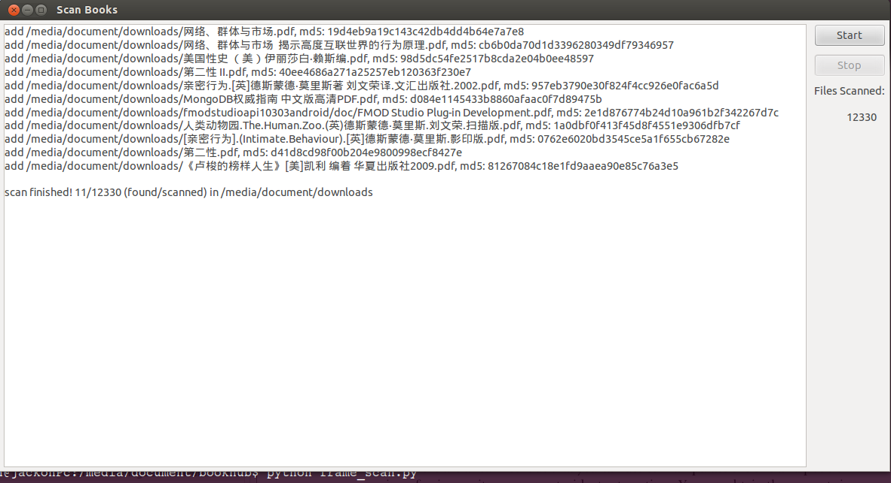

bookhub
=======

E-book management and sharing

Feature and Demo
----------------

#### Management

1. `F2` to rename display filename
2. Double click to open selected file
3. `Del` to delete selected files -- TODO
4. Edit book meta info -- TODO
5. Collect reading info for improving reading habit -- TODO

#### Sharing via Github

TODO

#### Collection

Scan and collect e-book with specific extensions on your disk

Dev-env
-------

#### Dependency

python, wxPython, MongoDb

TODO list
---------
